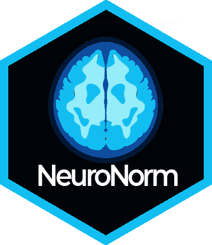

# NeuroNorm 

NeuroNorm is an R package that to preprocess structural magnetic resonance imaging (MRI) from multiple patients, diseases, scanners and sites. NeuroNorm transformed multiple raw T1-w images in the NIfTI format into preprocessed images comparable across patients, sites and diseases. Neuronorm performs inhomogeneity correction, spatial registration to a template, skull stripping, spatially informed MRI scan generation (segmentation), intensity normalization and intensity adjustment. NeuroNorm comes up as a standard procedure to compare and analyze multiple T1-w scans of different neurodegenerative diseases. This package is an extension of the master thesis **Detection and Classification of Neurodegenerative Diseases: A Spatially Informed Bayesian neural Network** which conducts a population-level analysis of neurodegenerative patients.

You can install RAVEL from github using `devtools`.

``` r
# install.packages("devtools")
devtools::install_github("DavidPayares/neuronorm")
```


