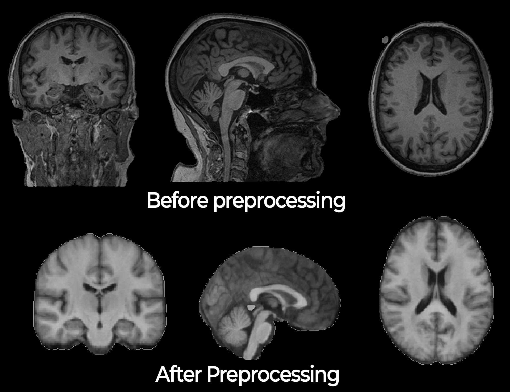

# NeuroNorm 

NeuroNorm is an R package that to preprocess structural magnetic resonance imaging (MRI) from multiple patients, diseases, scanners and sites. NeuroNorm transformed multiple raw T1-w images in the NIfTI format into preprocessed images comparable across patients, sites and diseases. Neuronorm performs inhomogeneity correction, spatial registration to a template, skull stripping, spatially informed MRI scan (brain segmentation) generation , intensity normalization and intensity adjustment. NeuroNorm comes up as a standard procedure to compare and analyze multiple T1-w scans of different neurodegenerative diseases. 

This package is an extension of the master thesis **Detection and Classification of Neurodegenerative Diseases: A Spatially Informed Bayesian neural Network** which conducts a population-level analysis of neurodegenerative patients.

## Background

After the acquisition of an MRI scan, due to the nature of its data, it needs to be processed before any statistical analysis, especially if the study involves multiple sources, multiple scans, and/or multiple subjects. The collection of transformations from the data is called imaging preprocessing. There are numerous steps in imaging preprocessing commonly used to reduce noise, adjust and standardize the data. The steps' order and relevance depend on the study aim and the neurologist criteria. 

The `NeuroNorm` package presents a preprocessing pipeline to transform raw images to images ready for any statistical analysis. First, the `NeuroNorm` package performs inhomogeneity correction using the N4 correction. Then it applies a non-linear registration to the MNI152 template using a diffeomorphism algorithm. It also only extracts the brain tissue using a brain mask derivated from the MNI atlas. The brain extraction is followed by a brain segmentation using Hidden Markov Random Fields (HMRF). The segmented image is considered as a spatially informed scan given the HMRF model properties. A control voxel mask image is obtained for applying the RAVEL intensity normalization. Finally, the intensities are normalized by using the RAVEL algorithm.

The methods and algorithms selected of `NeuroNorm` are a mainstay in the literature of brain imaging of neurodegeneration. `NeuroNorm` proposes a straightforward and simple preprocessing pipeline for integrating images from numerous neurodegenerative processes. 


## Installation

You can install NeuroNorm from github using `devtools`.

``` r
# install.packages("devtools")
devtools::install_github("DavidPayares/neuronorm")
```

`NeuroNorm` relies on many neuroimaging packages: `fslr`, `ANTsr`,  `extrantsr`, `MNITemplate` and `RAVEL`.
The package `fslr` is available on CRAN, and requires FSL to be installed on
your machine; see the [FSL website](http://fsl.fmrib.ox.ac.uk/fsl/fslwiki/) for installation. 
For `ANTsR`,`extrantsr` and `RAVEL`, it is recommended to install the latest stable version available at the [ANTsR](https://github.com/stnava/ANTsR/releases/), 
[extrantsr](https://github.com/muschellij2/extrantsr/releases/) and [RAVEL](https://github.com/Jfortin1/RAVEL) GitHub pages, respectively. 
For the template space, the MNI152 atlas with a isomorfic voxel size of 1mm is used. It is included in the `MNITemplate` package, available on GitHub at <https://github.com/Jfortin1/MNITemplate>. 

## Usage

### Data extructure

For using `NeuroNorm`, data must follow a specific structure. This makes easier and more intuitive the loading of input MRI scans and organization of output MRI files. MRI images must be in `NiFTI` format. 
Currently, `NeuroNorm` only supports T1-w sequence scans. However, other modalities will be implemented in future versions. It is recommended to store your data in the following structure:

```r
├── General_folder              # main folder
│   ├── disease01_patient01     # patient-level folder
│   │   ├── T1-w                # image in NiFTI format
│   │   ├── T2-w
│   ├── disease01_patient02
│   │   ├── T1-w
│   │   ├── T2-w
│   ├── disease02_patient01
│   │   ├── T1-w
│   │   ├── T2-w
│   │   ├── FLAIR
│   ├── disease02_patient02
└── │   ├── T1-w
```

### Data Loading

`NeuroNorm` only requires two parameters. The first one refers to the folder containing the data (see Data structure). The second parameter corresponds to the covariates of interest needed to perform 
the RAVEL intensity normalization. Covariates should be associated to the patient's scans. The `NeuroNorm`  packages comes with sample data including images, covariates and folder structure.

```r

library('neuronorm')

# Get folder with patients' folders
folder <- system.file("extdata", package = "neuronorm")
# Get clinical covariates for RAVEL normalization
covariates <- system.file("covariates.txt", package = "neuronorm")
# Read covariates information
clinical_info <- read.csv(file = covariates, sep = ';')

```


### Preprocessing 

The function `preprocess_patients` takes as input the folder containing the raw images and the covariates variable, applies the preprocessing pipeline to the input images, and creates preprocessed images for each process.

| Parameter            | Description                                                                                                                               |
| ---------------------| ----------------------------------------------------------------------------------------------------------------------------------------- |
| `patients.folder`    | `folder` containing folders per patient with raw T1-w images.                                                                             |
| `clinical.covariates`| `data.frame` of covariates associated to the MRI scans. Number of rows should be equal to the number of images.                           |


The main purpose of the function `preprocess_patients` is to create preprocessed images just by having the raw images and some covariates of interest.

```r

paths_preprocess_patients <- preprocess_patients(folder, clinical_info)

```

### Preprocessed images

After executing the `preprocess_patients`, a `list` of paths is created. The list containes the relatives paths to each of the preprocessed images organized by patient folder.

```r

library('oro.nifti')

img <- readNIfTI(file.path(paths_preprocess_patients$patient01$ravel))
orthographic(img)

```
To visualize the image, the `orthographic` function from the `oro.nifti` package is used. The image corresponds to a fully preprocessed MRI scan ready to use in further anlysis.

<p align="center">



</p

## References